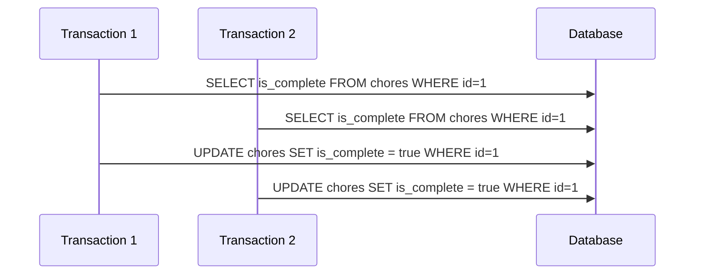
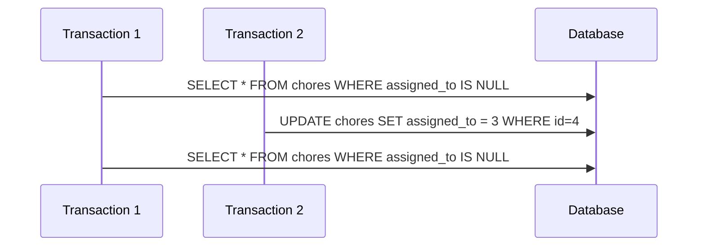
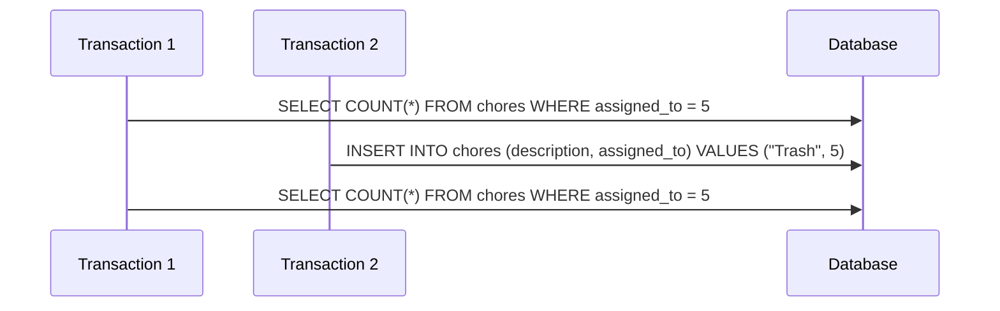

# Concurrency Control Documentation

This file documents three concurrency issues that would occur in our service if concurrency control were not in place. Each case includes a sequence diagram and the concurrency mechanism we use to prevent it.

## Case 1: Lost Update – Completing the Same Chore

Two users attempt to mark the same chore as complete at the same time. Both read `is_complete = false`, and both write `true`, but one update is lost.

Phenomenon: Lost Update

Solution: Use `SELECT ... FOR UPDATE` to apply row-level locking in the update transaction. This prevents two users from updating the same row concurrently.

## Case 2: Non-Repeatable Read – Checking Unassigned Chores

A user loads the list of unassigned chores. Another user assigns one of them during the transaction. When the first user checks again, the list has changed.

Phenomenon: Non-Repeatable Read

Solution: Use the `REPEATABLE READ` isolation level to ensure stable reads during the transaction.

## Case 3: Phantom Read – Counting Assigned Chores

A user queries how many chores are assigned to them. Another user inserts a new chore assigned to that user during the transaction, changing the result.

Phenomenon: Phantom Read

Solution: Use the `SERIALIZABLE` isolation level to prevent insertions that would change the result of a repeated query in the same transaction.
